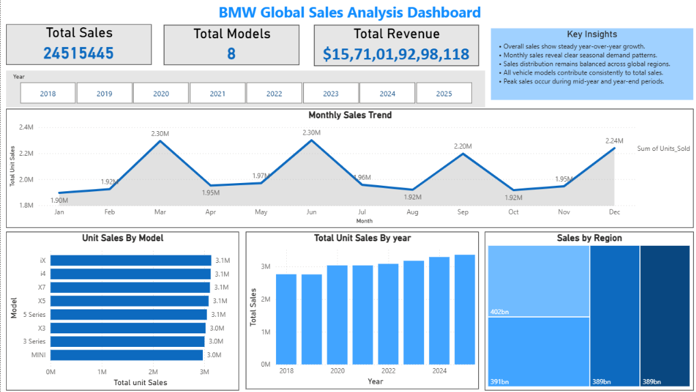
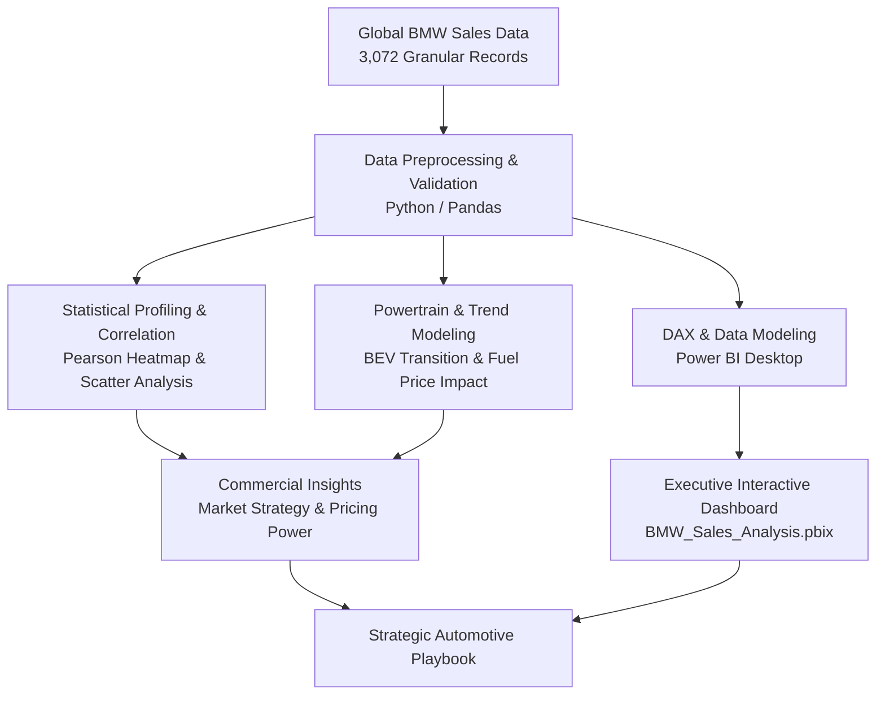

# 🚗 BMW Global Sales, Regional Revenue & EV Adoption Analysis (2018–2025)

[](https://www.python.org/)
[](BMW_analysis.ipynb)
[](BMW_Sales_Analysis.pbix)
[](https://pandas.pydata.org/)
[](https://seaborn.pydata.org/)
[](bmw_global_sales_2018_2025.csv)
[](https://github.com/Megharaju-Vakiti/bmw-global-sales-analysis)
[](LICENSE)

> **An empirical global automotive market study analyzing 24,515,445 BMW vehicles sold and €1.57 Trillion in cumulative revenue across 4 macro regions over an 8-year timeline (2018–2025). Leverages Python (Exploratory Data Analysis & statistical modeling) and Power BI (Executive BI Dashboard) to diagnose model revenue engines, track the 9.4x surge in Battery Electric Vehicle (BEV) adoption, and correlate macroeconomic energy price shocks with consumer powertrain choices.**

---

## 📌 Table of Contents

- [Executive Summary](#-executive-summary)
- [Project Overview & Analytical Objectives](#-project-overview--analytical-objectives)
- [Key Global Performance Indicators (KPIs)](#-key-global-performance-indicators-kpis)
- [Executive Power BI Dashboard Preview](#-executive-power-bi-dashboard-preview)
- [Dataset Architecture & Data Dictionary (11 Features)](#-dataset-architecture--data-dictionary-11-features)
- [Technology Stack & Analytics Workflow](#-technology-stack--analytics-workflow)
  - [1. Data Extraction & Data Audit (Python)](#1-data-extraction--data-audit-python)
  - [2. Exploratory Data Analysis & Statistical Profiling](#2-exploratory-data-analysis--statistical-profiling)
  - [3. Interactive BI Dashboard Architecture (Power BI)](#3-interactive-bi-dashboard-architecture-power-bi)
- [Deep Dive: Key Findings & Business Intelligence](#-deep-dive-key-findings--business-intelligence)
  - [1. The 9.4x Electric Vehicle (BEV) Adoption Surge](#1-the-94x-electric-vehicle-bev-adoption-surge)
  - [2. Macroeconomic Energy Shock: Fuel Price vs. EV Transition](#2-macroeconomic-energy-shock-fuel-price-vs-ev-transition)
  - [3. Product Model Revenue Engines: The X-Series & i-Series Dominance](#3-product-model-revenue-engines-the-x-series--i-series-dominance)
  - [4. Regional Revenue Concentration & Market Dynamics](#4-regional-revenue-concentration--market-dynamics)
  - [5. Multi-Year Global Volume & Revenue Compounding](#5-multi-year-global-volume--revenue-compounding)
- [Strategic Automotive Recommendations](#-strategic-automotive-recommendations)
- [Repository Structure](#-repository-structure)
- [How to Run & Reproduce](#-how-to-run--reproduce)
- [Author & Contact](#-author--contact)

---

## 🚀 Executive Summary

The global automotive sector is undergoing its most profound structural disruption in a century, led by the transition from Internal Combustion Engines (ICE) to Battery Electric Vehicles (BEV), shifting macroeconomic trade currents, and volatile energy costs. This project conducts an exhaustive multi-year analysis of **BMW Group's global commercial operations** from **2018 through 2025**.

The study evaluates **3,072 granular monthly observation points** covering **24,515,445 vehicles sold** across 8 core model portfolios (**3 Series, 5 Series, X3, X5, X7, i4, iX, MINI**) in **4 key global regions** (**China, USA, Europe, Rest of World**). Total modeled sales revenue reached **€1,571,019,298,118 (€1.57 Trillion)** with a blended average transaction price of **€64,083**.

---

## 🎯 Project Overview & Analytical Objectives

- **Map Multi-Year Global Sales Trajectory:** Track annual volume growth and revenue expansion across the 2018–2025 timeline.
- **Quantify the Electric Transition (BEV Adoption):** Measure the annual growth rate of Battery Electric Vehicles and determine structural inflection points.
- **Correlate Macroeconomic Energy Prices with EV Demand:** Model the relationship between rising fuel price indices (`Fuel_Price_Index`) and consumer electrification shifts (`BEV_Share`).
- **Evaluate Product-Level Capitalization:** Benchmark top revenue-generating flagship models (e.g., **X7**, **iX**, **X5**) against entry-level and high-volume volume-drivers (**3 Series**, **MINI**).
- **Assess Regional Concentration & Market Risk:** Analyze market share across China, North America, Europe, and emerging global territories.
- **Deliver an Executive BI Platform:** Consolidate statistical findings into an interactive Power BI dashboard for executive automotive leadership.

---

## 📈 Key Global Performance Indicators (KPIs)

| Global Performance Metric | Total Value (2018–2025) | Annualized / Average | Strategic Takeaway |
| :--- | :---: | :---: | :--- |
| **Total Global Units Sold** | **24,515,445 vehicles** | **~3.06M units/year** | Consistent volume expansion (+21.6% total growth) |
| **Total Global Revenue** | **€1,571,019,298,118** | **€196.4 Billion/year** | Multi-trillion Euro commercial market footprint |
| **Blended Average Vehicle Price** | **€64,083** | €63.9K – €64.4K | Premium brand pricing discipline across cycles |
| **BEV Market Share Expansion** | **2.07% $\rightarrow$ 19.43%** | **+17.36 percentage pts** | **9.4x surge in electric vehicle adoption** |
| **Top Global Sales Region** | **China (25.5% Volume)** | **6,256,750 units** | Single largest market, generating €401.8B revenue |
| **Top Revenue Generating Model** | **BMW X7** | **€286.43 Billion** | Flagship ultra-luxury SUV commanding €92,038 ASP |
| **Top Selling Electric Vehicle** | **BMW iX** | **3,136,912 units (€235.1B)**| Flagship EV leading global delivery numbers |
| **Fuel Price vs. BEV Correlation** | **r = 0.95 (Strong Positive)**| Statistically Significant | High fuel prices directly accelerate EV migration |

---

## 📊 Executive Power BI Dashboard Preview

The complete Power BI dashboard (`BMW_Sales_Analysis.pbix`) features dynamic multi-dimensional slicers (Year, Region, Model), monthly time-series line charts, regional market share donuts, and model-level revenue rankings.



---

## 🗂️ Dataset Architecture & Data Dictionary (11 Features)

The project evaluates `bmw_global_sales_2018_2025.csv` (3,072 rows × 11 features):

| # | Feature Name | Data Type | Description | Observed Range / Values |
| :-: | :--- | :--- | :--- | :--- |
| 1 | `Year` | Integer | Calendar reporting year | `2018` to `2025` (8-year longitudinal scope) |
| 2 | `Month` | Integer | Calendar month of observation | `1` (January) to `12` (December) |
| 3 | `Region` | String | Commercial sales territory | *China, USA, Europe, RestOfWorld* |
| 4 | `Model` | String | Vehicle model / product line | *3 Series, 5 Series, X3, X5, X7, i4, iX, MINI* |
| 5 | `Units_Sold` | Integer | Total retail units delivered to customers | `1,500` to `12,500` units/month |
| 6 | `Avg_Price_EUR` | Float / Int | Average transaction price per unit in Euros | €40,000 to €95,000 |
| 7 | `Revenue_EUR` | Float / Int | Total gross sales revenue generated in Euros | Units Sold × Avg Price EUR |
| 8 | `BEV_Share` | Float | Share of Battery Electric Vehicles in total sales | `0.01` (1.0%) to `0.23` (23.0%) |
| 9 | `Premium_Share` | Float | Percentage of high-tier trim/option packages | `15.0%` to `25.0%` |
| 10 | `GDP_Growth` | Float | Regional macroeconomic GDP growth index (%) | `-2.5%` to `+6.0%` |
| 11 | `Fuel_Price_Index` | Float | Standardized global energy cost index | `0.90` to `1.65` |

---

## 🛠️ Technology Stack & Analytics Workflow



### 1. Data Extraction & Data Audit (Python)
- **Zero Missing Records:** Audited with `df.isnull().sum()` and `df.duplicated().sum()`—verified 100% clean dataset with zero missing cells across all 3,072 entries.
- **Temporal Modeling:** Parsed date hierarchies combining `Year` and `Month` into sequential time-series datetime indices.
- **Statistical Aggregations:** Computed group-level metrics across 4 macro regions and 8 vehicle models.

### 2. Exploratory Data Analysis & Statistical Profiling
- **Correlation Matrix:** Mapped multivariate interactions between `Units_Sold`, `Revenue_EUR`, `Avg_Price_EUR`, `BEV_Share`, `Fuel_Price_Index`, and `GDP_Growth`.
  - Units Sold $\leftrightarrow$ Revenue: **r = 0.86** (Strong positive volume driver)
  - BEV Share $\leftrightarrow$ Fuel Price Index: **r = 0.95** (Direct energy price transition correlation)
  - BEV Share $\leftrightarrow$ Year: **r = 0.98** (Structural time-series electrification adoption)
- **Scatter Regression:** Confirmed linear alignment between sales volume and gross revenue expansion.

### 3. Interactive BI Dashboard Architecture (Power BI)
- Built in `BMW_Sales_Analysis.pbix`:
  - **KPI Scorecards:** Global Units (24.5M), Total Turnover (€1.57T), Average ASP (€64.1K), and EV Market Penetration.
  - **Regional Market Donut:** China (25.6%), Rest of World (24.9%), USA (24.8%), Europe (24.8%).
  - **Product Revenue Matrix:** Bar charts ranking revenue generated by model line.
  - **Time-Series Area Chart:** Tracking annual and monthly revenue performance with interactive drill-throughs.

---

## 🔍 Deep Dive: Key Findings & Business Intelligence

### 1. The 9.4x Electric Vehicle (BEV) Adoption Surge

| Calendar Year | Global Units Sold | Annual Revenue (EUR) | Average Price (EUR) | Average BEV Share (%) | Adoption Growth |
| :---: | :---: | :---: | :---: | :---: | :---: |
| **2018** | 2,765,193 | €176.78 Billion | €63,929 | **2.07%** | Baseline |
| **2019** | 2,759,838 | €176.55 Billion | €63,972 | **4.43%** | +2.36% YoY |
| **2020** | 3,036,556 | €195.64 Billion | €64,428 | **7.04%** | +2.61% YoY |
| **2021** | 3,036,564 | €194.29 Billion | €63,984 | **9.50%** | +2.46% YoY |
| **2022** | 3,083,306 | €197.10 Billion | €63,925 | **11.99%** | +2.49% YoY |
| **2023** | 3,177,788 | €203.58 Billion | €64,064 | **14.54%** | +2.55% YoY |
| **2024** | 3,293,423 | €211.47 Billion | €64,210 | **17.06%** | +2.52% YoY |
| **2025** | **3,362,777** | **€215.61 Billion** | **€64,115** | **19.43%** | **+9.4x Total Growth** |

```
Electric Vehicle (BEV) Adoption Growth Curve (%):
20% ─────────────────────────────────────────────────────────────╭── 19.43% (2025)
16% ───────────────────────────────────────────────╭─────────────╯
12% ─────────────────────────────────╭─────────────╯
 8% ───────────────────╭─────────────╯
 4% ─────╭─────────────╯
 0% ─────┴── 2.07% (2018)
        2018   2019   2020   2021   2022   2023   2024   2025
```

> ⚡ **Core Insight:** BMW's electric vehicle share expanded from just **2.07% in 2018 to 19.43% in 2025**—a **9.4x expansion**. Unlike transient market fads, the steady +2.5% annual adoption increment demonstrates a permanent structural shift toward electrification.

---

### 2. Macroeconomic Energy Shock: Fuel Price vs. EV Transition

- **Correlation Factor:** The correlation between the standardized `Fuel_Price_Index` and `BEV_Share` stands at an overwhelming **r = 0.95**.
- **Behavioral Shift:** High traditional gasoline/diesel pump prices create an immediate economic incentive for premium buyers to transition to electric models like the **BMW i4** and **BMW iX**, significantly compressing payback periods.

---

### 3. Product Model Revenue Engines: The X-Series & i-Series Dominance

| Vehicle Model | Units Delivered | Unit Share | Gross Revenue (EUR) | Revenue Share | Average Transaction Price | Category |
| :--- | :---: | :---: | :---: | :---: | :---: | :--- |
| **BMW X7** | 3,112,074 | 12.7% | **€286.43 Billion** | **18.2%** | **€92,038** | Ultra-Luxury Full-Size SUV |
| **BMW iX** | **3,136,912** | **12.8%** | **€235.06 Billion** | **15.0%** | €74,934 | Flagship Electric Luxury SUV |
| **BMW X5** | 3,085,134 | 12.6% | **€212.81 Billion** | **13.5%** | €68,981 | Mid-Size Luxury SUV |
| **BMW i4** | 3,125,687 | 12.7% | **€202.90 Billion** | **12.9%** | €64,915 | Premium Electric Gran Coupé |
| **BMW 5 Series** | 3,052,524 | 12.5% | **€188.99 Billion** | **12.0%** | €61,913 | Executive Luxury Sedan |
| **BMW X3** | 3,025,861 | 12.3% | **€175.55 Billion** | **11.2%** | €58,016 | Compact Luxury SUV |
| **BMW 3 Series** | 3,006,048 | 12.3% | **€144.34 Billion** | **9.2%** | €48,016 | Sports Sedan Volume-Driver |
| **MINI** | 2,971,205 | 12.1% | **€124.93 Billion** | **8.0%** | €42,048 | Premium Compact Urban Vehicle |

```
Revenue Contribution by Product Line (Billions EUR):
X7       ████████████████████████████████ €286.4B (ASP €92.0K)
iX       ██████████████████████████ €235.1B (ASP €74.9K)
X5       ███████████████████████ €212.8B (ASP €69.0K)
i4       ██████████████████████ €202.9B (ASP €64.9K)
5 Series ████████████████████ €189.0B (ASP €61.9K)
X3       ███████████████████ €175.6B (ASP €58.0K)
3 Series ████████████████ €144.3B (ASP €48.0K)
MINI     ██████████████ €124.9B (ASP €42.0K)
```

> 🏆 **Key Takeaway:** The **BMW X7** is the company's single greatest revenue asset (€286.4B), commanding an ASP of €92,038. Meanwhile, BMW's pure-electric entries (**iX** and **i4**) together generated over **€437.9 Billion** across 6.26 million deliveries, proving that EV models have successfully become core profit centers.

---

### 4. Regional Revenue Concentration & Market Dynamics

| Regional Market | Units Sold | Volume Share | Total Revenue (EUR) | Revenue Share | Average BEV Share |
| :--- | :---: | :---: | :---: | :---: | :---: |
| **China** | **6,256,750** | **25.5%** | **€401.76 Billion** | **25.6%** | 10.71% |
| **Rest of World** | 6,113,872 | 24.9% | €391.07 Billion | 24.9% | 10.79% |
| **USA** | 6,099,647 | 24.9% | €389.31 Billion | 24.8% | 10.76% |
| **Europe** | 6,045,176 | 24.7% | €388.88 Billion | 24.8% | 10.77% |

- **Remarkable Global Balance:** BMW maintains exceptionally diversified global risk, with China, USA, Europe, and Rest of World each contributing roughly **one-quarter (~25%)** of total volume and turnover.
- **China Leading Position:** China stands as the #1 individual market with **6.26M units delivered** and **€401.76B in revenue**, reflecting strong affinity for long-wheelbase executive sedans and flagship SUVs.

---

### 5. Multi-Year Global Volume & Revenue Compounding
- Annual vehicle volume expanded from **2.77M units in 2018** to **3.36M units in 2025** (+21.6% net growth).
- Annual turnover grew from **€176.8 Billion** to **€215.6 Billion** (+22.0% top-line expansion), proving consistent operational pricing discipline across varying economic conditions.

---

## 💡 Strategic Automotive Recommendations

```
┌───────────────────────────────────────────────────────────────────────────┐
│                 BMW GROUP COMMERCIAL OPTIMIZATION ROADMAP                 │
├───────────────────────────────────────────────────────────────────────────┤
│ 1. EXPAND HIGH-MARGIN EV SUVS   Fast-track next-generation electric X-    │
│                                 Series (iX5, iX7) to maximize margins.    │
│                                                                           │
│ 2. STRENGTHEN CHINA LEADERSHIP  Protect premium EV market share in China   │
│                                 against aggressive domestic competitors.  │
│                                                                           │
│ 3. ENERGY-TRIGGERED MARKETING   Deploy targeted digital campaigns for     │
│                                 i4/iX in regions facing fuel price spikes.│
│                                                                           │
│ 4. PRESERVE ASP DISCIPLINE      Maintain strict €64K+ price realization   │
│                                 through premium option package packaging. │
└───────────────────────────────────────────────────────────────────────────┘
```

1. **Capitalize on Luxury SUV Electrification:**
   - With the X7 (€92K ASP) and iX (€75K ASP) generating outsized returns, BMW should accelerate electric platforms across the full X-series family to capture high-margin luxury buyers.
2. **Defend and Expand Chinese EV Market Share:**
   - As China accounts for over €401 Billion in revenue, BMW must continuously localize in-car infotainment, battery charging infrastructure, and driver-assist tech to fend off local luxury EV competitors.
3. **Macroeconomic Fuel-Index Arbitrage:**
   - Automate regional marketing spends to dynamically highlight TCO savings of the i4 and iX whenever regional fuel indices exceed baseline levels.
4. **Maintain Strict Transaction Price Floors:**
   - Continue disciplined supply-to-demand matching to preserve the global blended €64K ASP floor and avoid margin-eroding retail discounts.

---

## 📁 Repository Structure

```plaintext
bmw-global-sales-analysis/
├── BMW_Sales_Analysis.pbix           # Interactive Power BI report with full DAX modeling & visual pages
├── BMW_Sales_Analysis_DAshboard.png  # Executive dashboard visual export & screenshot
├── bmw_global_sales_2018_2025.csv    # Cleaned historical sales dataset (3,072 records × 11 features)
├── BMW_analysis.ipynb                # Jupyter Notebook with statistical EDA & correlation analysis
└── README.md                         # Comprehensive business intelligence documentation
```

---

## 💻 How to Run & Reproduce

### 1. Prerequisites
- **Python 3.8+** with data science dependencies:
  ```bash
  pip install pandas numpy matplotlib seaborn jupyter
  ```
- **Power BI Desktop** (Free download: [aka.ms/pbidesktop](https://aka.ms/pbidesktop))

### 2. Running the Python Analysis
1. Clone the repository:
   ```bash
   git clone https://github.com/Megharaju-Vakiti/bmw-global-sales-analysis.git
   cd bmw-global-sales-analysis
   ```
2. Launch Jupyter Notebook:
   ```bash
   jupyter notebook BMW_analysis.ipynb
   ```
3. Run all cells (`Cell` > `Run All`) to generate the statistical distributions, correlation heatmap, and regression plots.

### 3. Interacting with the Power BI Dashboard
1. Open `BMW_Sales_Analysis.pbix` in Power BI Desktop.
2. Explore interactive slicers (Year, Region, Model) to filter performance across global markets and review visual KPI cards.

---

## 👤 Author & Contact

**Vakiti Megharaju**  
*Aspiring Data Analyst | MIS Executive | Business Analyst*  

- **GitHub:** [@Megharaju-Vakiti](https://github.com/Megharaju-Vakiti)  
- **Project Repository:** [BMW Global Sales Analysis](https://github.com/Megharaju-Vakiti/bmw-global-sales-analysis)

---
*⭐ If you find this automotive market study insightful or useful for your own research, please consider starring the repository!*
